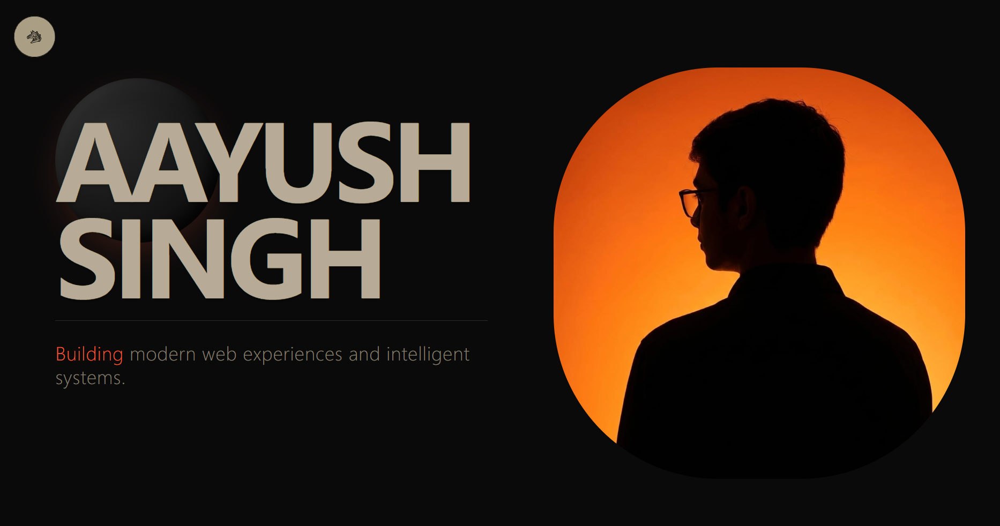

# 🚀 Aayush's Portfolio

[Live App](https://aayushdevfolio.vercel.app)



A modern, interactive, and highly responsive personal portfolio website built with Next.js 16, React 19, and Tailwind CSS v4. The project showcases my skills, projects, and 3D design integrations for a premium user experience.

## ✨ Features

- **Next.js & React 19**: Leveraging the latest features of Next.js App Router and React for optimal performance.
- **3D Interactive Elements**: Integrated robust 3D models using `@splinetool/react-spline` for an immersive aesthetic.
- **Smooth Scrolling**: Implemented smooth, buttery scrolling dynamics using `lenis` and `@studio-freight/react-lenis`.
- **Advanced Animations**: Scroll-triggered animations, page transitions, and micro-interactions powered by `framer-motion`.
- **Modern Styling**: Styled beautifully with the latest Tailwind CSS v4, keeping the aesthetic dynamic and responsive across all devices.
- **SEO Optimized**: Fully configured for Google Search Console and SEO best practices including dynamic robots setup.
- **Responsive Design**: Carefully tuned for all viewports—from extensive desktop layouts down to perfect mobile adjustments (including Hero and Arsenal sections).

## 🛠️ Tech Stack

- **Framework**: [Next.js](https://nextjs.org/) (App Router)
- **Library**: [React](https://react.dev/) 19 & TypeScript
- **Styling**: [Tailwind CSS](https://tailwindcss.com/) v4
- **Animations**: [Framer Motion](https://www.framer.com/motion/)
- **Smooth Scrolling**: [Lenis](https://lenis.studiofreight.com/)
- **3D Rendering**: [Spline](https://spline.design/)
- **Icons**: [Lucide React](https://lucide.dev/)

## 🚀 Getting Started

Follow these steps to set up the project locally.

### Prerequisites

Ensure you have Node.js (v20+ recommended) installed.

### Installation

1. Clone the repository (if not already cloned from your remote)
```bash
git clone https://github.com/Aayush4518/Portfolio.git
cd Portfolio
```

2. Install dependencies
```bash
npm install
# or
yarn install
# or
pnpm install
```

3. Run the development server
```bash
npm run dev
# or
yarn dev
# or
pnpm dev
```

4. Open [http://localhost:3000](http://localhost:3000) with your browser to see the outcome.

## 📁 Project Structure

- `src/app/` - Next.js App Router pages, global styles, and meta configurations (`robots.ts`, SEO metafiles).
- `src/components/` - Reusable UI components (`Hero.tsx`, `Projects.tsx`, `BackToTop.tsx`, etc.).
- `public/` - Static assets.
- `package.json` - Project dependencies and scripts.

## 🚢 Deployment

The easiest way to deploy this Next.js app is to use the [Vercel Platform](https://vercel.com/new).
For more details, check out the [Next.js deployment documentation](https://nextjs.org/docs/app/building-your-application/deploying).

---

For any feedback or suggestions, feel free to reach out to me at aayushs290107@gmail.com
